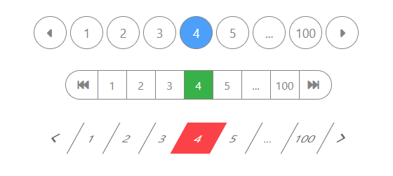

# React-pagination

[](https://npmjs.com/package/@ngochuytu/react-pagination)

**ReactJS component to render a pagination.**

Install and customize your own pagination component



Styling example [here](https://codesandbox.io/s/ngochuytu-react-pagination-styling-example-jthzuq?file=/src/PaginationStylingExample/PaginationStylingExample.js)

# Installation

Install `@ngochuytu/react-pagination` with [npm](https://www.npmjs.com/package/@ngochuytu/react-pagination)

```
$ npm install @ngochuytu/react-pagination
```

# Usage

PaginationExample.js

```javascript
import React, { useState } from 'react';
import { Pagination } from '@ngochuytu/react-pagination';

const LoadingSpinner = (props) => {
  return (
    <div className="spinner-container">
      <div className="spinner"></div>
    </div>
  );
};

const PaginationExample = (props) => {
  const [isLoading, setIsLoading] = useState(false);
  const [currentPage, setCurrentPage] = useState(1);
  const dataPerPage = 10;

  const listData = new Array(dataPerPage).fill(0).map((_, index) => {
    const rowNumber = index + (currentPage - 1) * dataPerPage;
    return (
      <div key={rowNumber}>
        <p>This is row number {rowNumber}</p>
      </div>
    );
  });

  const onPageChange = (activePage) => {
    //Fetch api here
    setIsLoading(true);
    setTimeout(() => {
      setIsLoading(false);
      setCurrentPage(activePage);
    }, 1000);
  };

  return (
    <div className="pagination-example-container">
      <h1>This is page number {currentPage}</h1>
      {listData}
      <Pagination
        totalPages={100}
        activePage={1}
        breakButtonStep={2}
        pageRange={9}
        onPageChange={onPageChange}
        navigateToFirstPageButtonLabel="&#171;"
        navigateToLastPageButtonLabel="&#187;"
      />
      {isLoading && <LoadingSpinner />}
    </div>
  );
};
```

PaginationExample.style.css (This is only for spinner, you can skip this part)

```css
/*Spinner Ref: https://codepen.io/hannibalza/pen/MWVvoJw*/
.spinner-container {
  position: absolute;
  top: 0;
  left: 0;
  width: 100%;
  height: 100%;
  z-index: 99999;
  text-align: center;
  background-color: rgba(0, 0, 0, 0.3);
}

.spinner {
  margin: auto;
  border: 2px solid #dbf2ff;
  width: 32px;
  height: 32px;
  display: inline-block;
  position: absolute;
  top: 45%;
  border-radius: 50%;
  border-right: 2px solid #018df7;
  text-align: center;
  animation-name: spin;
  animation-duration: 900ms;
  animation-iteration-count: infinite;
  animation-timing-function: cubic-bezier(0.53, 0.21, 0.29, 0.67);
}
@-webkit-keyframes spin {
  0% {
    -webkit-transform: rotate(0deg);
  }
  100% {
    -webkit-transform: rotate(360deg);
  }
}
@keyframes spin {
  0% {
    -webkit-transform: rotate(0deg);
  }
  100% {
    -webkit-transform: rotate(360deg);
  }
}

.pagination-example-container {
  position: relative;
}
```

Test it on [CodeSandbox](https://codesandbox.io/s/ngochuytu-react-pagination-hz4gkz?file=/src/components/PaginationExample/PaginationExample.js).

# Props

| Name                                 |   Type    | Default | Description                                                                                                                                              |
| ------------------------------------ | :-------: | :-----: | -------------------------------------------------------------------------------------------------------------------------------------------------------- |
| `totalPages`                         |  number   |         | **(Required)** The total number of pages                                                                                                                 |
| `activePage`                         |  number   |         | (Optional) The initial active page. The default value is 1. This value is uncontrolled, `activePage` then will be controlled by component's state        |
| `pageRange`                          |  number   |   `7`   | (Optional) **(Min: 5)** Range of pages displayed, exclude 2 navigation button to first and last page.                                                    |
| `breakButtonStep`                    |  number   |   `1`   | (Optional) Step of break button.                                                                                                                         |
| `disableNavigationButtons`           |  boolean  | `false` | (Optional) Disable 2 navigation buttons.                                                                                                                 |
| `disableInitialOnPageChangeCall`     |  boolean  | `false` | (Optional) Disable initial `onPageChange` call. You might have to turn off [Strict mode](https://reactjs.org/docs/strict-mode.html) in development mode. |
| `containerClassName`                 |  string   |         | (Optional) ClassName of pagination's container                                                                                                           |
| `pageButtonClassName`                |  string   |         | (Optional) ClassName of each page button                                                                                                                 |
| `activePageButtonClassName`          |  string   |         | (Optional) ClassName of active page button                                                                                                               |
| `navigateToFirstPageButtonClassName` |  string   |         | (Optional) ClassName of navigate to first page button                                                                                                    |
| `navigateToLastPageButtonClassName`  |  string   |         | (Optional) ClassName of navigate to last page button                                                                                                     |
| `breakButtonClassName`               |  string   |         | (Optional) ClassName of break button                                                                                                                     |
| `navigateToFirstPageButtonLabel`     | ReactNode | `"<<"`  | (Optional) Label for the navigate to first page button                                                                                                   |
| `navigateToLastPageButtonLabel`      | ReactNode | `">>"`  | (Optional) Label for the navigate to last page button                                                                                                    |
| `breakButtonLabel`                   | ReactNode | `"..."` | (Optional) Label for the break button                                                                                                                    |
| `onPageChange`                       | Function  |         | (Optional) Page change handler, receive `activePage` as an argument                                                                                      |
